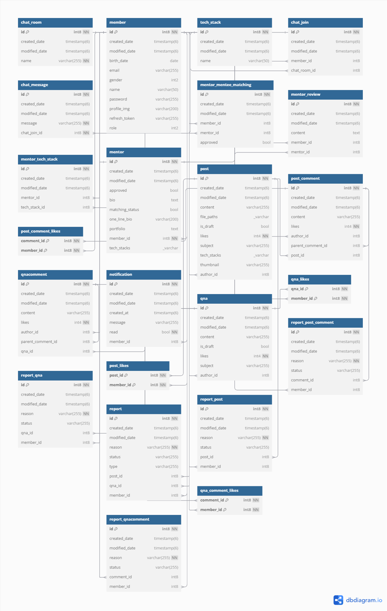
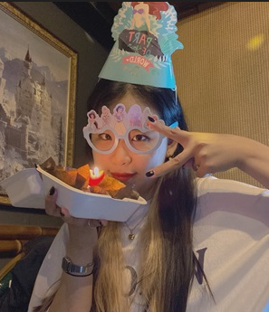

## 🚀프로젝트 명 : ToTee-Block(토티블록)
- 웹 URL : localhost:8081
- DB PORT : 3306
- DB username : postgres
- 데이터베이스 이름 : toteeblock-db

## 📢 프로젝트 목표
- 개발자들 간 기술 블로그
- 멘토 멘티 매칭 시스템
- 실시간 채팅으로 인한 소통

## ⏱️개발 기간
- 전체 개발 기간 : 2024-11-08 ~ 2024-12-27
- 프로젝트 주제 선정 기간 : 2024-11-08 ~ 2024-11-15
- UI 구현 : 2024-11-15 ~ 2024-12-27
- 기능 구현 : 2024-11-15 ~ 2024-12-27

## ⚙ 개발 환경
- 운영체제 : Windows 11
- 통합개발환경(IDE) : IntelliJ
- JDK 버전 : JDK 17
- 데이터 베이스 : PostgreSQL
- 빌드 툴 : Gradle
- 관리 툴 : GitHub


## 🔌 Dependencies
- Spring Boot DevTools
- Spring Data JPA
- Spring Validation
- Spring Web MVC
- Spring Security
- Springdoc OpenAPI
- PostgreSQL
- JWT
- Lombok
- Spring Mail
- Spring Messaging
- Spring WebSocket

## 💻 기술 스택
- 백엔드
    - SpringBoot, Spring Security, Spring Data JPA, Spring Mail, JWT, WebSocket
- 프론트엔드
    - TXS, SCSS, React, Node.js, Next.js, markdown
- 데이터베이스
    - PostgreSQL
    - Docker, DBeaver

## 🛠 DB 테이블 설계
- chat_room (채팅방)
- member (회원)
- tech_stack (기술 스택)
- chat_join (채팅 참여)
- chat_message (채팅 메시지)
- mentor (멘토)
- mentor_mentee_matching (멘토-멘티 매칭)
- mentor_review (멘토 리뷰)
- mentor_tech_stack (멘토 기술 스택)
- notification (알림)
- post (게시물)
- post_comment (게시물 댓글)
- post_comment_likes (게시물 댓글 좋아요)
- post_likes (게시물 좋아요)
- qna (질문과 답변)
- qna_likes (질문과 답변 좋아요)
- qnacomment (질문과 답변 댓글)
- report (신고)
- report_post (게시물 신고)
- report_post_comment (게시물 댓글 신고)
- report_qna (질문과 답변 신고)
- report_qnacomment (질문과 답변 댓글 신고)
- qna_comment_likes (질문과 답변 댓글 좋아요)

<br>

| E-R 다이어그램 |
|-----------|
|  |

<br>

## 👨‍👩‍👧‍👦 조원 소개

<div align="center">

|                                                     **박승수 (팀장)**                                                      |                                                      **황혜현 (부팀장)**                                                      |                                                            **김진아**                                                            |                                                          **유윤하**                                                          |
|:---------------------------------------------------------------------------------------------------------------------:|:-----------------------------------------------------------------------------------------------------------------------:|:-----------------------------------------------------------------------------------------------------------------------------:|:-------------------------------------------------------------------------------------------------------------------------:|
| [  <br/> @anyeok](https://github.com/anyeok) | [ <br/> @hyeon924](https://github.com/hyeon924) | [ <br/> @jinainkorea](https://github.com/jinainkorea) | [ <br/> @yoonha-yu](https://github.com/yoonha-yu) |

|                                                       **유지훈**                                                       |                                                  **이상수**                                                   |                                                              **이은철**                                                              |
|:-------------------------------------------------------------------------------------------------------------------:|:----------------------------------------------------------------------------------------------------------:|:---------------------------------------------------------------------------------------------------------------------------------:|
|      [ <br/> @psm817](https://github.com/psm817)       | [ <br/> @jiyoung-0y0](https://github.com/jiyoung-0y0) | [ <br/> @LEEEUNCHEOL96](https://github.com/LEEEUNCHEOL96) |

</div>

## 🧑‍🏫 역할 분담

### 🍋‍🟩 박승수 (팀장)
- **UI**
    - 페이지 : 로그인, 회원가입, 회원 정보 수정, 비밀번호 수정, 관리자 페이지, 알림
- **기능**
    1. 멘토
       - 멘토 정보 조회
    2. 알림
       - WebSocket을 활용한 실시간 알림 기능
- **연동(백, 프론트 연동)**
    1. 회원
       - 회원가입
       - 로그인
       - 로그아웃
       - 회원 정보 수정
       - 비밀번호 수정
    2. 관리자
       - 회원 관리
       - 멘토 승인 관리
       - 게시글 관리
       - 신고글 관리
    3. 메인페이지
       - 멘토 정보
       - 알림
    4. 멘토 멘티
       - 멘토 세부 디테일
       - 멘토 찾기
        
<br>

### 🍋‍🟩 황혜현 (부팀장)
- 프론트 기반 소스 정리
- font 모듈화
- color 모듈화
- 모든 파일 components 모듈화 기반 소스 정리

<br>

### 🍋‍🟩 김진아
- **UI**
    - 페이지 : 포스팅, QnA, 글 에디터
- **기능**
    1. 회원
        - 로그인
        - 로그아웃
        - 회원 정보 수정
        - 이메일 인증
    2. 관리자
        - 회원 관리
        - 멘토 승인 관리
    3. DB 연동
        - AWS RDS: postgreSql

- **연동(백, 프론트 연동)**
    1. 메인페이지
        - 포스팅 정보
    2. 포스팅 & QnA
        - 전체 열람
        - 상세페이지
        - 댓글 & 대댓글
        - **에디터**
    - 글 작성
        - 글 수정
        - 썸네일 이미지 등록

<br>

### 🍋‍🟩 유윤하
- **UI**  메인, 상세, 멘토, QnA, 에디터
- **기능**
  1. 공통
      - 페이지 전환 로딩 애니메이션 구현
      - 푸터 자동차 애니메이션 구현
      - global.scss 구현
  2. 메인페이지
      - 전체 UI 디자인 구현
      - 메인 섹션 레이아웃
      - 멘토 카드 컴포넌트 디자인
  3. 멘토
      - 상세페이지 디자인
      - 멘토 리스트 레이아웃
      - 멘토 정보 조회 페이지
  4. 소개페이지
     -전체 UI 디자인 구현
  5. QnA
      - 상세페이지 디자인
      - 질문 섹션 레이아웃
  6. 에디터
      - 마크다운 에디터 구현
      - 드래그 앤 드롭 이미지 업로드
      - 실시간 미리보기 기능
      - 에디터/프리뷰 분할 레이아웃
      - 마크다운 문법 스타일링

<br>

### 🍋‍🟩 유지훈
- **기능**
    1. 채팅
        -  WebSocket을 활용한 실시간 채팅
        - 이모지,이미지 전송
    2. 알림
        - 채팅 알림   

<br>

### 🍋‍🟩 이상수

- **UI**
    - 채팅 창, 채팅 위젯 버튼
- **기능**
    1. 멘토
        - 엔티티 생성
        - 멘토 신청
    2. 기술 스택
        - 엔티티 생성
    3. 채팅
        - 엔티티 수정
        - 채팅방 선택
        - 채팅 기록 불러오기

- **연동(백, 프론트 연동)**
    1. 채팅
        - 송신자, 수신자 메세지 구분
            - 채팅 방 별로 메세지 구분
            - 실시간 채팅
            - 채팅 기록
            - 채팅 방 리스트 표시 및 선택
    2. 모든페이지
        - 채팅 위젯 버튼 적용

<br>

### 🍋‍🟩 이은철
- **기능**
    1. 포스트, 질문게시판
        - CRUD
        - 임시저장
        - 좋아요
    2. 댓글
        - CRUD
        - 대댓글
    3. 신고
        - 등록
        - 신고 게시글 삭제
    4. 알림
        - 댓글, 신고 알림

<br>

## 📝 프로젝트 전체 구조

```
백엔드
│  MainApplication.java
│
├─domain
│  ├─Chat
│  │  ├─controller
│  │  │      ChatController.java
│  │  │
│  │  ├─dto
│  │  │      ChatDTO.java
│  │  │
│  │  ├─entity
│  │  │      ChatJoin.java
│  │  │      ChatMessage.java
│  │  │      ChatRoom.java
│  │  │
│  │  ├─repository
│  │  │      ChatJoinRepository.java
│  │  │      ChatMessageRepository.java
│  │  │      ChatRoomRepository.java
│  │  │
│  │  └─serivce
│  │          ChatService.java
│  │
│  ├─Email
│  │  ├─dto
│  │  │      EmailDTO.java
│  │  │
│  │  └─service
│  │          EmailService.java
│  │
│  ├─Member
│  │  ├─controller
│  │  │      ApiV1AdminMemberController.java
│  │  │      ApiV1MemberController.java
│  │  │
│  │  ├─dto
│  │  │      MemberDTO.java
│  │  │
│  │  ├─entity
│  │  │      Member.java
│  │  │
│  │  ├─enums
│  │  │      MemberGender.java
│  │  │      MemberRole.java
│  │  │
│  │  ├─repository
│  │  │      MemberRepository.java
│  │  │
│  │  ├─request
│  │  │      AuthcodeRequest.java
│  │  │      MemberCreate.java
│  │  │      MemberRequest.java
│  │  │      PasswordChangeRequest.java
│  │  │
│  │  └─service
│  │          MemberService.java
│  │
│  ├─Mentor
│  │  ├─controller
│  │  │      ApiV1AdminMentorController.java
│  │  │      ApiV1MentorController.java
│  │  │
│  │  ├─dto
│  │  │      MatchingDTO.java
│  │  │      MentorDTO.java
│  │  │
│  │  ├─entity
│  │  │      Mentor.java
│  │  │      MentorMenteeMatching.java
│  │  │      MentorReview.java
│  │  │
│  │  ├─repository
│  │  │      MentorMenteeMatchingRepository.java
│  │  │      MentorRepository.java
│  │  │      MentorReviewRepository.java
│  │  │
│  │  ├─request
│  │  │      ApproveMentoringRequest.java
│  │  │      ApproveMentorRequest.java
│  │  │      MentoringRequest.java
│  │  │      MentorRegistrationRequest.java
│  │  │
│  │  └─service
│  │          MentorMenteeMatchingService.java
│  │          MentorService.java
│  │
│  ├─notification
│  │  ├─controller
│  │  │      ApiV1NotificationController.java
│  │  │
│  │  ├─dto
│  │  │      NotificationDTO.java
│  │  │
│  │  ├─entity
│  │  │      Notification.java
│  │  │
│  │  ├─repository
│  │  │      NotificationRepository.java
│  │  │
│  │  └─service
│  │          NotificationService.java
│  │
│  ├─Post
│  │  ├─Comment
│  │  │  ├─controller
│  │  │  │      ApiV1AdminPostCommentController.java
│  │  │  │      ApiV1PostCommentController.java
│  │  │  │      ApiV1PostReplyController.java
│  │  │  │
│  │  │  ├─dto
│  │  │  │  │  PostCommentDTO.java
│  │  │  │  │
│  │  │  │  ├─request
│  │  │  │  │      PostCommentCreateRequest.java
│  │  │  │  │      PostCommentLikeDTO.java
│  │  │  │  │      PostCommentModifyRequest.java
│  │  │  │  │
│  │  │  │  └─response
│  │  │  │          PostCommentCreateResponse.java
│  │  │  │          PostCommentModifyResponse.java
│  │  │  │          PostCommentResponse.java
│  │  │  │          PostCommentsResponse.java
│  │  │  │
│  │  │  ├─entity
│  │  │  │      PostComment.java
│  │  │  │
│  │  │  ├─repository
│  │  │  │      PostCommentRepository.java
│  │  │  │
│  │  │  └─service
│  │  │          PostCommentService.java
│  │  │
│  │  ├─controller
│  │  │      ApiV1AdminPostController.java
│  │  │      ApiV1PostController.java
│  │  │
│  │  ├─dto
│  │  │  │  PostDTO.java
│  │  │  │
│  │  │  ├─request
│  │  │  │      PostCreateRequest.java
│  │  │  │      PostLikeDTO.java
│  │  │  │      PostModifyRequest.java
│  │  │  │
│  │  │  └─response
│  │  │          PostCreateResponse.java
│  │  │          PostModifyResponse.java
│  │  │          PostResponse.java
│  │  │          PostsResponse.java
│  │  │
│  │  ├─entity
│  │  │      Post.java
│  │  │
│  │  ├─repository
│  │  │      PostRepository.java
│  │  │
│  │  └─service
│  │          PostService.java
│  │
│  ├─QnA
│  │  ├─Comment
│  │  │  ├─controller
│  │  │  │      ApiV1AdminQnACommentController.java
│  │  │  │      ApiV1QnACommentController.java
│  │  │  │      ApiV1QnAReplyController.java
│  │  │  │
│  │  │  ├─dto
│  │  │  │  │  QnACommentDTO.java
│  │  │  │  │
│  │  │  │  ├─request
│  │  │  │  │      QnACommentCreateRequest.java
│  │  │  │  │      QnACommentLikeDTO.java
│  │  │  │  │      QnACommentModifyRequest.java
│  │  │  │  │
│  │  │  │  └─response
│  │  │  │          QnACommentCreateResponse.java
│  │  │  │          QnACommentModifyResponse.java
│  │  │  │          QnACommentResponse.java
│  │  │  │          QnACommentsResponse.java
│  │  │  │
│  │  │  ├─entity
│  │  │  │      QnAComment.java
│  │  │  │
│  │  │  ├─repository
│  │  │  │      QnACommentRepository.java
│  │  │  │
│  │  │  └─service
│  │  │          QnACommentService.java
│  │  │
│  │  ├─controller
│  │  │      ApiV1AdminQnAController.java
│  │  │      ApiV1QnAController.java
│  │  │
│  │  ├─dto
│  │  │  │  QnADTO.java
│  │  │  │
│  │  │  ├─request
│  │  │  │      QnACreateRequest.java
│  │  │  │      QnALikeDTO.java
│  │  │  │      QnAModifyRequest.java
│  │  │  │
│  │  │  └─response
│  │  │          QnACreateResponse.java
│  │  │          QnAModifyResponse.java
│  │  │          QnAResponse.java
│  │  │          QnAsResponse.java
│  │  │
│  │  ├─entity
│  │  │      QnA.java
│  │  │
│  │  ├─repository
│  │  │      QnARepository.java
│  │  │
│  │  └─service
│  │          QnAService.java
│  │
│  ├─Report
│  │  ├─controller
│  │  │      ApiV1ReportAdminController.java
│  │  │      ApiV1ReportController.java
│  │  │
│  │  ├─dto
│  │  │  │  ReportDTO.java
│  │  │  │
│  │  │  ├─request
│  │  │  │      ReportRequest.java
│  │  │  │
│  │  │  └─summary
│  │  │          SummaryDTO.java
│  │  │
│  │  ├─entity
│  │  │      Report.java
│  │  │
│  │  ├─enums
│  │  │      ReportReason.java
│  │  │      ReportStatus.java
│  │  │
│  │  ├─repository
│  │  │      ReportRepository.java
│  │  │
│  │  └─service
│  │          ReportService.java
│  │
│  └─TechStack
│      ├─controller
│      │      ApiV1TechStackController.java
│      │
│      ├─dto
│      │      TechStackDTO.java
│      │
│      └─enums
│              TechStacks.java
│
└─global
    │  GlobalExceptionHandler.java
    │
    ├─Config
    │      WebMvcConfig.java
    │      WebSocketConfig.java
    │
    ├─ErrorMessages
    │      ErrorMessages.java
    │
    ├─InitData
    │      Init.java
    │
    ├─Jpa
    │      BaseEntity.java
    │
    ├─Jwt
    │      JwtProvider.java
    │
    ├─RsData
    │      RsData.java
    │
    ├─Security
    │      ApiSecurityConfig.java
    │      ChattingConfig.java
    │      JwtAuthorizationFilter.java
    │      SecurityConfig.java
    │      SecurityMember.java
    │      Webconfig.java
    │
    ├─TEST
    │      EmptyMultipartFile.java
    │
    └─Util
        │  Util.java
        │
        └─Service
                ImageService.java

프론트엔드
public
│  file.svg
│  globe.svg
│  next.svg
│  vercel.svg
│  window.svg
│
├─fonts
│      NotoSans-Bold.ttf
│      NotoSans-Medium.ttf
│      NotoSans-Regular.ttf
│
├─icon
│      arrow.svg
│      at_sign.svg
│      basicimage.svg
│      basicimage01.svg
│      bold.svg
│      card01.svg
│      card02.svg
│      card03.svg
│      chevrons_left.svg
│      chevrons_right.svg
│      chevron_left.svg
│      chevron_right.svg
│      circle_user.svg
│      close_eye.svg
│      ellipsis.svg
│      face_smile.svg
│      H1.svg
│      H2.svg
│      H3.svg
│      H4.svg
│      heart.svg
│      link.svg
│      loader.svg
│      location_arrow.svg
│      manager_calendrier.svg
│      manager_search.svg
│      manager_searchbox.svg
│      mdi_bell.svg
│      mdi_eye.svg
│      modify_pen.svg
│      more.svg
│      open_eye.svg
│      question.svg
│      sad.svg
│      search.svg
│      smile.svg
│      Star1.svg
│      syntax.svg
│      textline.svg
│      thumbs_up.svg
│      trash.svg
│      trash_can.svg
│      upload.svg
│      user.svg
│      x-close.svg
│      yellow_botton.svg
│
└─images
        background-img.png
        Background.png
        card.jpg
        card01.png
        card02.png
        card03.png
        image2.jpg
        image3.jpg
        image4.jpg
        image44.jpg
        image5.jpg
        image6.jpg
        image7.jpg
        image8.jpg
        image9.jpg
        logo.svg
        macmockup.png
        mentormentee.png
        pixel-car.png
        Rectangle.png
        
src
├─api
│      axiosConfig.ts
│
├─app
│  │  layout.tsx
│  │  page.tsx
│  │
│  ├─about
│  │      page.tsx
│  │
│  ├─blog
│  │      page.tsx
│  │
│  ├─chatting
│  │      page.tsx
│  │
│  ├─editor
│  │      page.tsx
│  │
│  ├─manager
│  │      page.tsx
│  │
│  ├─members
│  │  │  page.tsx
│  │  │
│  │  ├─join
│  │  │      page.tsx
│  │  │
│  │  ├─me
│  │  │      page.tsx
│  │  │
│  │  └─password
│  │          page.tsx
│  │
│  ├─mentor
│  │  │  page.tsx
│  │  │
│  │  ├─detail
│  │  │  └─[id]
│  │  │          page.tsx
│  │  │
│  │  ├─form
│  │  │      page.tsx
│  │  │
│  │  └─mymentor
│  │          page.tsx
│  │
│  ├─post
│  │  │  page.tsx
│  │  │
│  │  └─detail
│  │          page.tsx
│  │
│  └─qna
│      │  page.tsx
│      │
│      ├─detail
│      │      page.tsx
│      │
│      └─my
│              page.tsx
│
├─components
│  │  divideBar.tsx
│  │  Footer.tsx
│  │  Header.tsx
│  │  MarkdownWithHtml.tsx
│  │  Tabs.tsx
│  │
│  ├─animation
│  │      loading.tsx
│  │
│  ├─birthday
│  │      Birthday.tsx
│  │
│  ├─button
│  │  │  ApplyButton.tsx
│  │  │  CheckButton.tsx
│  │  │  EditButton.tsx
│  │  │  GenderButton.tsx
│  │  │  LikeButton.tsx
│  │  │  LinkButton.tsx
│  │  │  Loginbutton.tsx
│  │  │  MentorApplyButton.tsx
│  │  │  MentorButton.tsx
│  │  │  ModifyButton.tsx
│  │  │  MoreButton.tsx
│  │  │  RemoveButton.tsx
│  │  │  ReportButton.tsx
│  │  │  SubmitButton.tsx
│  │  │  TextLinkButton.tsx
│  │  │
│  │  └─EditorActionButtom
│  │          ActionButton.tsx
│  │
│  ├─card
│  │      CommentCard.tsx
│  │      LinkCard.tsx
│  │      MentorCard.tsx
│  │      PostCard.tsx
│  │
│  ├─chatting
│  │      ChatButton.tsx
│  │      ChatContainer.tsx
│  │      ChatFooter.tsx
│  │      ChatHeader.tsx
│  │      ChatList.tsx
│  │      ChatMessages.tsx
│  │      ChatSection.tsx
│  │
│  ├─editortoolbar
│  │      editortoolbar.tsx
│  │      fileupload.tsx
│  │
│  ├─exception
│  │      NoSearch.tsx
│  │
│  ├─form
│  │      CommentForm.tsx
│  │
│  ├─input
│  │      TextInput.tsx
│  │
│  ├─loadingprovier
│  │      loadingprovider.tsx
│  │
│  ├─manager
│  │      Pagination.tsx
│  │      SerchFilter.tsx
│  │      Sidebar.tsx
│  │      Table.tsx
│  │
│  ├─mentoring
│  │      Mentoring.tsx
│  │
│  ├─modal
│  │      ReportModal.tsx
│  │      YesNoModal.tsx
│  │
│  ├─pagewrapper
│  │      pagewrapper.tsx
│  │
│  ├─pagination
│  │      custompagination.tsx
│  │
│  ├─profile
│  │      ProfileImage.tsx
│  │
│  ├─search
│  │      SearchBox.tsx
│  │
│  └─tag
│          tag.tsx
│
└─types
        sockjs-client.d.ts
        
styles
├─components
│  │  divide-bar.module.scss
│  │  footer.module.scss
│  │  header.module.scss
│  │  tabs.module.scss
│  │
│  ├─animation
│  │      car.module.scss
│  │      loading.module.scss
│  │
│  ├─birthday
│  │      birthday.module.scss
│  │
│  ├─button
│  │  │  apply-button.module.scss
│  │  │  check-button.module.scss
│  │  │  edit-botton.module.scss
│  │  │  gender-button.module.scss
│  │  │  like-button.module.scss
│  │  │  link-button.module.scss
│  │  │  login-button.module.scss
│  │  │  mentor-apply-button.module.scss
│  │  │  mentor-button.module.scss
│  │  │  modify-button.module.scss
│  │  │  more-button.module.scss
│  │  │  remove-button.module.scss
│  │  │  report-button.module.scss
│  │  │  submit-button.module.scss
│  │  │  text-link-button.module.scss
│  │  │
│  │  └─editor
│  │          editoraction-button.module.scss
│  │
│  ├─card
│  │      comment-card.module.scss
│  │      link-card.module.scss
│  │      mentor-card.module.scss
│  │      post-card.module.scss
│  │
│  ├─chatting
│  │      ChatButton.module.scss
│  │      ChatContainer.module.scss
│  │      ChatFooter.module.scss
│  │      ChatHeader.module.scss
│  │      ChatList.module.scss
│  │      ChatMessages.module.scss
│  │
│  ├─editortoolbar
│  │      editortoolbar.module.scss
│  │      fileupload.module.scss
│  │
│  ├─exception
│  │      no-search.module.scss
│  │
│  ├─form
│  │      comment-form.module.scss
│  │
│  ├─input
│  │      text-input.module.scss
│  │
│  ├─manager
│  │      pagination.module.scss
│  │      serchFilter.module.scss
│  │      sidebar.module.scss
│  │      table.module.scss
│  │
│  ├─mentoring
│  │      mentoring.module.scss
│  │
│  ├─modal
│  │      report-modal.module.scss
│  │      yesno-modal.module.scss
│  │
│  ├─pagination
│  │      pagination.module.scss
│  │
│  ├─profile
│  │      profile.module.scss
│  │
│  ├─search
│  │      searchBox.module.scss
│  │
│  └─tag
│          tag.module.scss
│
├─globals
│      color.scss
│      font-mixin.scss
│      font.scss
│      global.scss
│
└─pages
    │  about.module.scss
    │  home.module.scss
    │  home.scss
    │
    ├─blog
    │      blog.module.scss
    │
    ├─chatting
    │      chatting.module.scss
    │
    ├─editor
    │      editor.module.scss
    │
    ├─manager
    │      manager.module.scss
    │
    ├─members
    │      form.module.scss
    │      join.module.scss
    │      login.module.scss
    │      password.module.scss
    │
    ├─mentor
    │      mentor-detail.module.scss
    │      mentor-form.module.scss
    │      mentor.module.scss
    │      mymentor.module.scss
    │
    ├─post
    │      detail.module.scss
    │      list.module.scss
    │
    └─qna
            detail.module.scss
            myqna.module.scss
            qna.module.scss
```

## 🧜‍♀️ 작업 관리 방법

- GitHub Projects와 Issues를 사용하여 진행 상황을 공유했습니다.
- 매일 본인의 작업 양을 소화하고 각자 구현한 기능을 서로 테스트하며 프로그램의 신뢰성을 높였습니다.
- main으로 직접 올리기 보단 dev에서 기능들을 테스트 해보고 main으로 최종적으로 코드를 올려 프로그램의 신뢰성을 높였습니다.

## ⭐ 페이지별 기능 소개

### [메인화면]
- 홈페이지 접속 시 초기화면으로 화면의 기본 구조는 상단 메뉴바, 중간 사이트 소개, 멘토 신청, 개발 질문답변, 게시글 리스트, 멘토 리스트, 하단 footer로 구분되어 있습니다.
  - 상단 메뉴바는 토티블럭, 블로그, 질문답변, 멘토찾기, 멘토신청, 프로필 이미지, 알림으로 구성되어 있습니다.
  - 회원의 프로필 이미지를 클릭하여 프로필, 비밀번호 수정, 나의 블로그, 나의 QnA, 로그아웃으로 구성되어 있습니다.
  - 중간 본문에는 사이트 소개, 멘토 신청, 개발 질문답변으로 나열되어 있습니다.
  - 중간 본문 아래 게시글이 정렬되어 있고, 아래에는 멘토들이 인기순으로 나열되어 있습니다.
  - 각 요약된 정보들은 해당 부분을 누르면 해당 페이지로 이동이 가능합니다.
  - 하단 footer는 이용약관과 개인정보처리방침을 비롯한 ToTeeBlock의 기본 정보를 나타냅니다.
- 로그인과 비로그인 시 화면에 나타나는 메뉴가 상의합니다.
    - 로그인이 되어 있지 않은 경우 : 로그인
    - 마이페이지, 비밀번호 수정, 나의 블로그, 나의 QnA, 로그아웃

| 메인화면                                                         |
|--------------------------------------------------------------|
|  |

<br>

### [회원가입]
- 회원가입의 모든 항목에 대한 유효성 검사를 적용하여 입력하지 않으면 회원가입이 진행되지 않습니다.
- ID는 중복확인을 필수로, 비밀번호는 비밀번호 확인절차를 거칩니다.
- 회원의 권한은 일반 유저로 시작하게 되며, 멘토 신청을 하게 되면 관리자가 허가하여 멘토를 승인하게 됩니다.
- 회원가입이 완료되면 메인화면으로 이동 됩니다.

| 회원가입                                                          |
|---------------------------------------------------------------|
|  |

<br>

### [로그인]
- 회원가입을 통해 생성된 아이디와 비밀번호로 로그인을 수행합니다.
- 회원가입, 아이디 찾기, 비밀번호 재설정 페이지로 이동할 수 있는 버튼이 있습니다.
- 로그인에 성공하면 메인화면으로 이동합니다.

| 로그인                                                          |
|--------------------------------------------------------------|
|  |

<br>

### [아이디 찾기, 비밀번호 재설정]
- 아이디 찾기 버튼을 통해 회원가입 시 입력한 이메일 주소를 입력하고 찾기 버튼을 누르면 해당 회원의 아이디를 보여줍니다.
- 비밀번호 재설정 버튼을 통해 회원가입 시 입력한 아이디와 이메일 주소를 입력하면 해당 이메일 주소로 인증을 하면 비밀번호 재설정 페이지로 넘어갑니다.
-비밀번호 재설정 후 로그인이 가능합니다.

| 아이디 찾기, 비밀번호 재설정                                         |
|-----------------------------------------------------------------|
|   |
|  |

<br>

### [마이페이지]
- 로그인이 되어있는 사용자만 마이페이지에 진입할 수 있습니다.
- 마이페이지 내 메뉴는 프로필 이미지 등록/삭제 버튼, 이메일, 이름, 생년월일, 성별, 나가기/수정 버튼이 있습니다.
    - 프로필 이미지 등록/삭제 : 일반회원이 원하는 이미지를 프로필 사진으로 등록/삭제할 수 있습니다.
    - 이메일 : 회원가입 시 기재한 이메일을 보여줍니다.
    - 이름 : 회원가입 시 기재한 이름을 보여주며 수정할 수 있습니다.
    - 생년월일 : 회원가입 시 기재한 생년월일을 보여주며 수정할 수 있습니다.
    - 성별 : 회원가입 시 기재한 성별을 보여주며 수정할 수 있습니다.
    - 나가기 버튼 : 일반회원이 나가기 버튼을 통해 메인페이지로 이동할 수 있습니다.
    - 수정 버튼 : 정보를 수정 하기를 원할 경우 수정 버튼을통해 정보를 수정할 수 있습니다.
- 각 회원의 권한마다 메뉴별로 보이는 화면이 상이합니다.
    - 멘토 (mentor)
        - 신청 리스트 : 멘티로부터 멘토 요청을 받으면 이를 보여줍니다. 신청을 받았을 경우, 수락/거절을 할 수 있습니다. 멘티로부터 수락된 경우, 채팅 신청/연결 끊기를 할 수 있습니다.
    - 멘티 (mentee)
        - 멘토 리스트 : 멘토 요청 후 멘티로 수락된 경우 멘토가 표시됩니다. 또한 채팅 신청/연결 끊기를 할 수 있습니다.


| 마이페이지                                                              |
|--------------------------------------------------------------------|
|  |
|   |
|   |

<br>

### [로그아웃]
- 상단 헤더의 로그아웃 버튼을 클릭하면 로그아웃과 동시에 메인페이지로 이동합니다.

<br>

### [토티블록]
- 토티블록은 기업 소개 페이지로 토티블록의 소개와 목표 및 개요를 설명합니다.

| 토티블록                                                          |
|---------------------------------------------------------------|
|  |

<br>

### [블로그]
- 블로그는 기술적 지식과 경험을 체계적으로 기록하여, 지식의 누적과 공유할 수 있습니다.
- 다양한 기술 스택을 다루는 개발자들이 모여 서로의 인사이트를 공유하며 함께 성장할 수 있는 커뮤니티를 형성할 수 있습니다.
- 최신 기술과 개발 트렌드를 빠르게 습득하여 자신만의 개발 스킬과 지식을 꾸준히 업데이트할 수 있습니다.
- 블로그는 최신 글/인기 글/My Post 세 가지의 소 메뉴로 구분됩니다.
    - 최신 글 : 등록일 기준으로 오름차순으로 게시된 포스트를 볼 수 있습니다.
    - 인기 글 : 좋아요 10개 이상의 포스트를 볼 수 있습니다.
    - My Post : 자신이 포스팅한 포스트를 볼 수 있는 페이지로 이동할 수 있습니다.
- 블로그에 등록된 모든 포스트를 보여주고, 썸네일과 제목을 통해 주제를 한눈에 확인할 수 있습니다.
- 포스트를 클릭하면 해당 포스트 상세 보기 화면으로 이동이 가능합니다.
- 제목과 내용의 키워드를 통해 검색할 수 있습니다.


| 블로그                                                          |
|---------------------------------------------------------------|
|  |
|  |

<br>

#### [My Post]
- 로그인이 되어있는 사용자만 My Post에 진입할 수 있습니다.
- My Post에서는 자신이 등록한 모든 포스트를 보여주고, 썸네일과 제목을 통해 한눈에 확인할 수 있습니다.
- 기술 스택 버튼을 통해 자신이 작성한 포스트가 어떤 기술 스택과 관련이 있는지 확인할 수 있습니다.
- 글쓰기 버튼을 통해 에디터 페이지로 이동할 수 있습니다.

| My Post                                                       |
|---------------------------------------------------------------|
|    |
|  |

<br>

### [포스트]
- 포스트 화면을 통해 기술적 지식과 경험을 공유받을 수 있습니다.
- 포스트 화면에 등록된 기술 스택을 확인할 수 있습니다.
- 각 회원의 권한마다 기능이 상이합니다.
    - 비회원
        - 화면 내에서 포스트의 내용과 댓글을 볼 수 있습니다.
    - 일반회원
        - 포스트의 수정, 삭제는 포스트를 게시한 회원에게만 권한이 있습니다.
        - 포스트에 댓글을 작성할 수 있습니다,
            - 포스트의 댓글에 좋아요를 할 수 있습니다.
                - 좋아요 취소는 등록한 회원에게만 권한이 있습니다.
            - 포스트의 댓글 수정, 삭제는 댓글을 등록한 회원에게만 권한이 있습니다.
            - 포스트의 댓글에 대댓글을 등록할 수 있습니다.
        - 포스트에 좋아요를 할 수 있습니다.
            - 좋아요 취소는 등록한 회원에게만 권한이 있습니다.
        - 포스트에 신고하기 버튼을 통해 신고할 수 있습니다.
            - 신고하기는 5가지 사유를 선택할 수 있으며 기타 내용을 기재할 수 있습니다.

| 포스트                                                        |
|-------------------------------------------------------------|
|  |

<br>


#### [글쓰기 에디터]
- 로그인이 되어있는 사용자만 에디터에 진입할 수 있습니다.
- 기술적 지식과 경험을 기록할 수 있습니다.
    - 기술 스택을 구분할 수 있습니다.
    - 에디터에서 이미지 아이콘을 클릭하거나, 마크다운 문법을 사용하여 이미지를 삽입할 수 있습니다.
    - 에디터에서 드래그 앤 드롭 방식으로 이미지를 올리거나, 이미지 아이콘을 통해 파일을 선택하여 파일 업로드를 할 수 있습니다.
    - 우측 미리보기 화면을 확인하며 글의 형식이나 레이아웃, 스타일 등을 실시간으로 확인할 수 있습니다.
    - 작성완료 버튼을 누르면 썸네일을 등록 할 수 있으며 작성완료를 통해 등록/취소할 수 있습니다.
        - 파일업로드를 통해 썸네일을 지정한 후 지정된 썸네일을 확인할 수 있습니다.
    - 나가기 버튼을 통해 이전 페이지로 이동할 수 있습니다.

| 글쓰기 에디터                                                          |
|---------------------------------------------------------------|
|  |

<br>

### [질문답변]
- 질문답변에 등록된 모든 Q&A를 보여주고 제목, 작성자를 확인할 수 있습니다.
- 질문답변은 기술적 지식에 대해서 궁금점을 로그인한 모든 회원이 질문을 등록할 수 있습니다.
- 질문답변에 제목을 클릭하면 해당 Q&A 상세 보기 화면으로 이동이 가능합니다.
- 각 회원의 권한마다 기능이 상이합니다.
    - 비회원
        - 화면 내에서 Q&A 내용과 댓글을 볼 수 있습니다.
    - 일반회원
        - Q&A의 수정, 삭제는 포스트를 게시한 회원에게만 권한이 있습니다.
        - Q&A에 댓글을 작성할 수 있습니다,
            - Q&A의 댓글에 좋아요를 할 수 있습니다.
              -좋아요 취소는 등록한 회원에게만 권한이 있습니다.
            - Q&A의 댓글 수정, 삭제는 댓글을 등록한 회원에게만 권한이 있습니다.
            - Q&A의 댓글에 대댓글을 등록할 수 있습니다.
        - Q&A에 좋아요를 할 수 있습니다.
            - 좋아요 취소는 등록한 회원에게만 권한이 있습니다.
        - Q&A에 신고하기 버튼을 통해 신고할 수 있습니다.
            - 신고하기는 5가지 사유를 선택할 수 있으며 기타 내용을 기재할 수 있습니다.


| 질문답변                                                          |
|---------------------------------------------------------------|
|  |

<br>

### [멘토찾기]
- 멘토찾기에서는 멘토로 등록된 모든 멘토 보여주고 프로필 사진, 이름, 멘토 한 줄 소개를 확인할 수 있습니다.
- 멘토 프로필 사진을 클릭하면 상세 보기 화면으로 이동이 가능합니다.
  -멘토 상세 보기
    - 멘토 상세 보기에서는 프로필 사진, 이름, 한 줄 소개를 확인할 수 있습니다.
    - 멘토 상세 보기에서는 멘토 신청시 등록한 자기소개, 포트폴리오 주소, 추가정보를 확인할 수 있습니다.
    - 추가정보에서는 이메일, 승인 상태, 매칭 상태, 생성일, 수정일을 확인 할 수 있습니다.
    - 매칭 상태는 승인 대기 중인 상태가 기본이며 관리자 승인시 매칭됨으로 변경될 수 있습니다.
    - 수정 버튼을 통해 정보를 수정할 수 있습니다. 수정은 멘토 신청한  본인에게만 권한이 있습니다.


| 멘토찾기                                             |
|---------------------------------------------------------------|
|  |
|    |

<br>


### [멘토 신청]
- 멘토 신청은 멘토의 자격으로 기술적 지식과 경험을 멘티에게 공유하기 위해 멘토 신청을 할 수 있습니다.
- 멘토 신청은 신청 버튼을 통해 로그인이 되어있는 사용자만 할 수 있습니다.
    - 프로필 사진을 파일 업로드를 통해 등록할 수 있습니다.
    - 멘토 신청 한 줄 소개를 기재할 수 있습니다.
    - 자기소개를 기재할 수 있습니다.
    - 자신이 보유한 기술 스택을 선택할 수 있습니다.
    - 포트폴리오 주소를 기재할 수 있습니다.


| 멘토 신청                                             |
|---------------------------------------------------------------|
|  |
|    |

<br>

### [알림]
- 헤더 우측의 알림 아이콘을 통해 로그인이 되어있는 사용자만 확인할 수 있습니다.
- 각 회원의 권한마다 알림 내용이 상이합니다.
    - 관리자 (admin)
        - 관리자는 멘토 신청 등록, 포스트/Q&A 신고 등록, 포스트 삭제 시 알림을 확인 할 수 있습니다.
            - 메세지 알림은 기능별로 상이합니다.
                - 멘토 신청 등록 : '~님께서 멘토 등록 신청하셨습니다.'
                - 포스트/Q&A 신고 등록 : '신고가 되었습니다. 관리자 확인이 필요합니다.'
                - 포스트 삭제 : '관리자가 "~"를 삭제했습니다.'
    - 일반회원
        - '알림이 없습니다.' 라는 기본 메세지 알림을 확인할 수 있습니다.
        - 일반회원은 포스트/Q&A 댓글 등록, 대댓글 등록, 신고, 관리자에 의해 포스트 삭제, 멘토신청 시 알림을 확인할 수 있습니다.
            - 메세지 알림은 기능별로 상이합니다.
                - 포스트 댓글 등록 : '게시물 "~"에 댓글이 달렸습니다.'
                - Q&A 댓글 등록 : 'Q&A 게시물 "~"에 댓글이 달렸습니다.'
                - 대댓글 등록 : '대댓글이 달렸습니다.'
                - 신고 : '신고가 되었습니다.'
                - 포스트 관리자 삭제 : '관리자에 의해 "~"가 삭제되었습니다.'
                - 멘토 신청 : '멘토 신청이 성공적으로 접수가 되었습니다.'


| 알림                                             |
|---------------------------------------------------------------|
|  |
|    |

<br>

### [관리자페이지]
- 관리자(admin)만 접속할 수 있습니다.
- 관리자페이지는 플랫폼의 원활한 운영과 관리를 위해 있습니다.
- 관리자페이지에서는 네 가지 소 메뉴로 구분됩니다
    - 회원 관리
        - No, ID, Name, Create DATE, TYPE, STATUS를 확인할 수 있습니다.
            - STATUS : 삭제 버튼을 통해 해당 회원을 삭제할 수 있습니다.
    - 멘토 승인 관리
        - No, ID, Name, Create DATE, STATUS를 확인할 수 있습니다.
            - STATUS : 승인/거부 버튼을 통해 해당 회원의 멘토 신청을 승인/거부할 수 있습니다.
    - 게시글 관리
        - No, ID, Name, Create DATE, URL. STATUS를 확인할 수 있습니다.
            - STATUS : 삭제 버튼을 통해 해당 게시물을 삭제할 수 있습니다.
    - 신고 글 관리
        - No, 신고자, 작성자, 제목, 사유, 상태, 신고일, STATUS를 확인할 수 있습니다.
            - STATUS : 글 삭제/반려 버튼을 통해 신고된 게시글을 삭제하거나 상태를 변경할 수 있습니다.


| 관리자페이지                                             |
|---------------------------------------------------------------|
|  |
|    |

<br>

### [채팅]
- 채팅은 멘토와 멘티가 실시간으로 메시지를 주고받으며 소통하는 기능입니다.
- 우측 하단의 메시지 아이콘을 클릭하면 채팅 리스트를 확인할 수 있습니다.
- 멘토-멘티 관계가 형성되면 자동으로 채팅방이 생성됩니다.
    - 실시간 채팅
        - 메시지를 전송하면 전송 일자와 시간이 표시됩니다.
        - 본인이 보낸 메시지는 채팅방 우측에, 상대방이 보낸 메시지는 좌측에 표시됩니다.
        - 이모티콘 아이콘을 클릭하여 이모티콘을 보낼 수 있습니다.
        - 파일 업로드 아이콘을 클릭하여 이미지를 전송할 수 있습니다.


| 채팅                                             |
|---------------------------------------------------------------|
|  |
|    |

<br>

## 💥 트러블 슈팅
<details>
<summary> ❗박승수 </summary>

#### <1> <b>채팅 연결</b>

```문제``` 회원 프로필에서 연결된 멘토와 채팅을 연결 하였을 때 채팅방 Id 값은 들어가는데 채팅 join 테이블에서 아이디가 안들어가는 문제를 확인
</br></br>
```해결``` 채팅 Join 테이블에서 멘토의 memberId값과 멘티의 memberId값을 엮은 값을 넣어 문제를 해결 하였습니다.
</br></br></br>
</details>

<details>
<summary> ❗김진아 </summary>

#### <1> <b>jwt토큰과 시큐리티 같이 사용하기</b>

```문제``` jwt토큰을 도입 후, 관리자 관련 컨트롤러는 *.hasRole("ADMIN")을 통해 관리자의 권한을 가진 사용자만이 요청을 할 수 있도록 관리자의 인가 처리가 필요한 상황이었는데, 적용이 되지 않았다.
</br></br>
```해결```
1. jwtAuthorizationFilter에서, 토큰에서 사용자 정보를 추출해 Authentication타입의, 사용자의 인증에 필요한 정보를 시큐리티에 등록한다.
  ```java// 토큰으로부터 사용자 인증 정보 추출
            Authentication authentication = memberService.getUserFromAccessToken(accessToken)
                                                         .genAuthentication();
            // 시큐리티에 인증 정보 등록
            SecurityContextHolder.getContext().setAuthentication(authentication);
```
2. 시큐리티에서 jwtAuthorizationFilter를 UsernamePasswordAuthenticationFilter보다 먼저 적용되도록 설정코드를 추가해준다.
   ```.addFilterBefore(jwtAuthorizationFilter, UsernamePasswordAuthenticationFilter.class);```
   </br></br></br>

#### <2> <b>로그인과 로그아웃의 웹 쿠키</b>

```문제``` 로그인할 때 생성하는 웹 쿠키를 로그아웃할 때 삭제하지 못 함.
</br></br>
```해결``` 웹 쿠키는 이름이 같아도 설정된 경로가 다르면 다른 쿠키로 인식된다. 따라서, 로그인할 때 생성하는 쿠키와 로그아웃할 때 삭제하는 쿠키의 경로를 동일시 하였더니 제대로 삭제됨을 확인 하였다.
</br></br></br>
</details>

<details> 
<summary> ❗유윤하 </summary> 

#### <1> <b> 마크다운 에디터 이미지 드래그 앤 드롭 시 미리보기 렌더링 문제 </b>

```문제```  
마크다운 에디터에 이미지를 드래그 앤 드롭했을 때 텍스트 영역에는 이미지 마크다운 구문이 삽입되지만, 미리보기 화면에서 이미지가 표시되지 않는 문제가 발생했습니다.
</br></br>
```해결```  
ReactMarkdown 컴포넌트의 img 태그 렌더링을 커스터마이징하여 이미지 표시 문제를 해결했습니다. 드래그 앤 드롭된 이미지 파일에 대해 URL.createObjectURL로 임시 URL을 생성하고, 이를 상태로 관리하여 미리보기에서 이미지를 정상적으로 표시할 수 있도록 했습니다.

```typescript
const handleDrop = (e: React.DragEvent<HTMLTextAreaElement>) => {
  const file = e.dataTransfer.files[0];
  if (file?.type.startsWith("image/")) {
    const imageUrl = URL.createObjectURL(file);
    const imageKey = `image-${Date.now()}`;
    setImages(prev => ({ …prev, [imageKey]: imageUrl }));
  }
}; 
```

이를 통해 드래그 앤 드롭된 이미지가 에디터와 미리보기 양쪽에서 정상적으로 표시되도록 구현했습니다.

</br></br></br>
</details>

<details>
<summary> ❗유지훈 </summary>

#### <1> <b> 사용자가 보낸 메시지가 DB에 저장되지 않는 문제 </b>

```문제```  사용자가 메시지를 전송하면 클라이언트에서는 정상적으로 표시되지만, DB에 메시지가 저장되지 않아 이후 조회 시 메시지가 누락되는 현상이 발생.

</br></br>
```해결``` 서비스 로직에서 메시지를 저장하는 부분에서 save() 메서드 호출이 누락되거나 올바르게 호출되지 않았다.
ChatMessage 엔티티가 데이터베이스와 매핑되지 않은 경우 발생.

메시지를 저장할 때 chatMessageRepository.save()를 명시적으로 호출.
ChatMessage 엔티티에 필요한 필드와 매핑 어노테이션(@Entity, @ManyToOne 등)을 정확히 설정한다.

` @ManyToOne(fetch = FetchType.LAZY)
    @JoinColumn(name = "member_id"),   @JoinColumn(name = "chat_room_id"), chatMessageRepository.save(chatMessage);
`

이 설정을 통해 DB에서 저장된 메시지가 정확히 조회되고, 클라이언트에서 누락 없이 메시지를 확인 가능하게 되었다.
</br></br></br>
</details>

<details>
<summary> ❗이상수 </summary>
sock.js 이용하다가 stomp.js 로 바꿈
메세지를 보낸 것과 받은 것이 제대로 구분되게 함

#### <1> <b>메세지를 방 별로 송수신</b>

```문제``` 메세지 실시간 송수신까지는 문제가 없었으나, 채팅 방 구분 없이 모든 메세지가 송수신되는 문제가 있었다.
</br></br>
```해결``` 백엔드에서는 기존 Chat 엔티티만 사용하던 것을 ChatMessage, ChatJoin, ChatRoom 으로 메세지, 방 참가자, 방 별로 세분화 하고, 프론트에서는 stomp.js의 방 구독 기능을 이용하여 채팅 방 별로 메세지 송수신을 구분하였다.
</br></br></br>

#### <2> <b>메세지 수신, 송신 구별</b>

```문제``` 메세지 실시간 전송과 채팅 방마다 메세지 구분은 되었지만, 메세지를 내가 보낸건지 상대가 보낸건지 구별할 수 없었다. 채팅 방을 나갔다가 다시 들어오면 송수신자 별로 구분이 되었지만 채팅 방에서 실시간으로 있는 동안에는 구분되지 않았다.
</br></br>
```해결``` 서버에서 송신자, 수신자를 미리 구별하고 클라이언트에서는 출력만 하는 방식으로 구현하려 했다. 채팅 기록은 이 방식으로 구현해서 되었기 때문이다. 하지만 이 방식을 사용해도 안되자 클라이언트에 로그인 정보를 가져와 수신자인지 아닌지를 구분하는 방식을 사용했다. 이미 로그인 기능으로 LocalStorage에 userEmail(로그인한 사용자의 아이디 값)이 저장되고 있었고, 이 값을 이용해 메세지 데이터에 송신자의 Email값과 비교해서 송신자인지 수신자인지를 구분해서 출력할 수 있었다.
</br></br></br>

#### <3> <b>ChatJoin 엔티티의 유니크 설정 문제</b>

```문제``` ChatJoin 엔티티는 채팅 방에 참가자를 구분하기 위해 만든 엔티티로 Member_id와 ChatRoom_id 컬럼이 있고, Member_id와 ChatRoom_id의 두 값이 모두 같은 컬럼은 하나 이상 만들어지지 못하게 설정하려고 했는데, @Column(unique=true)만으로는 해결하지 못하고 있었다.
</br></br>
```해결``` @Table(name = "chat_join", uniqueConstraints =  {@UniqueConstraint(columnNames = {"member_id", "chat_room_id"})})을 사용했다. 이 어노테이션은 "member_id", "chat_room_id" 두 컬럼을 마치 하나의 컬럼에 유니크를 적용한 것처럼 작동한다. @Column(unique=true)를 사용하면 (member_id, chat_room_id)의 값이 (1, 2), (1, 1) 인 경우 규칙을 어긴 것이지만 위 어노테이션을 사용하면 허용된다.
</br></br></br>
</details>

<details>
<summary> ❗이은철 </summary>

#### <1> <b> 게시글에 대해서 삭제 처리를 하기위해 참조되는 댓글을 삭제 하는데 트랜잭션 관련 오류 </b>

```문제```  삭제하려 할 때 Post를 참조하는 댓글이 존재하여 외래 키 제약 조건을 위반하는 문제
</br></br>
```해결``` 트랜지션만 단순하게 설정하는것이아니라 게시글 삭제 기능을 수행할때
해당 게시글의 댓글을 먼저 삭제하고 게시글을 삭제하도록 설정하였다.
@Transactional 어노테이션을 사용하여 트랜잭션 관리를 통해 Post와 관련된 PostComment들을 삭제한 후 Post를 삭제할 수 있다.
또한

`@OneToMany(mappedBy = "post", fetch = FetchType.EAGER, cascade = CascadeType.ALL, orphanRemoval = true)
@OrderBy("createdDate DESC")
private List<PostComment> comments;`

이 설정을 통해 트랜잭션 처리와 함께 사용하여, 외래키 제약 조건 위반 없이 자동으로 관계가 정리되고,
추가적인 삭제 처리 없이도 Post의 삭제가 정상적으로 처리되었다.
</br></br>
</details>

## 🫸 개선해야 할 점

- 중복되는 코드 제거
    - layout.html 이라는 공통된 템플릿을 두고 사용하다보니 각 html에 대한 css을 작성할 때 혹시라도 겹치는 클래스명이나 태그가 있으면 서로 css 적용이 안되는 경우가 있었습니다.
    - 하나의 기능을 위해서 각 컨트롤러에서 중복된 코드를 사용한 경우가 있는데 프로그램의 속도 향상을 위해 코드를 간소화할 방법을 찾아봐야 할 것 같습니다.

<br>

## 🧑‍🎓 프로젝트를 마치며..

### 🍋‍🟩 박승수
이번 7명으로 구성된 팀 프로젝트의 팀장을 맡게 되어 영광이었습니다.

인원이 많은 만큼 기획부터 개발까지 기반 틀을 잘 잡고 가야 한다는 생각으로 초반 회의 때 팀원분들과 이견을 종합하여 잘 다져 나갔던 거 같습니다.

저희의 프로젝트는 저와 팀원분들의 실력 향상에 중점을 두고, 새로운 기술들을 두려워하지 않고 도전하여 성공을 이루는 계기가 되었습니다.

프론트와 백을 오고 가며, 연동시키며 모든 기능을 완성 시켰습니다.

가장 기억에 남는 기능은 WebSocket을 활용한 알림을 처음 구현해 보는 것 입니다.

실시간으로 알림 기능을 구현하며 도전하면 된다는 것을 깨닫는 중요한 프로젝트 기간이었습니다.

<br>

### 🐶 황혜현
안녕하세요!
이번 회고는 프로젝트와 학원 생활의 마무리를 담는 글이 될 것 같아요. 비록 프로젝트에 직접 참여한 비중은 크지 않았지만, 되돌아보니 함께 고민하며 구조를 잡아갔던 경험이 지금 회사 생활에도 큰 도움이 되고 있다는 점에서 참 값진 시간이었습니다.

처음 접해보는 프레임워크나 기술도 학원을 통해 배운 기초가 있었기에 비교적 수월하게 적응할 수 있었던 것 같아요. 하지만 여전히 실력에 대한 막연한 불안감은 저를 따라다니고 있습니다. 주변에서 부족하다고 지적하는 사람은 없지만, 스스로 느끼는 한계는 부정할 수 없기에 더 조급함을 느끼곤 해요.

그렇지만 돌이켜보면 이런 불안은 저를 앞으로 나아가게 하는 원동력이 되어왔습니다. 그 불안을 이겨내기 위해 노력하고, 작은 성장을 이루는 경험이 또 다른 도전을 이어가는 용기가 되어주었으니까요.

이번 회고를 통해 여러분께 꼭 전하고 싶은 메시지가 있다면, 스스로를 너무 몰아붙이지 말았으면 좋겠다는 것입니다. 적당한 불안과 자극은 발전의 원천이 될 수 있지만, 지나친 자기 질책은 생각보다 크게 도움이 되지 않는다는 걸 인생을 살아가며 깨닫게 되었습니다. (가끔은 뻔뻔한게 정신건강에 이로울지도 ,,ㅎㅎ)

만약 오늘 하루가 부족했다면 더 나은 내일을 기약하며 꿀잠 주무시고, 오늘이 만족스러웠다면 스스로에게 작은 칭찬(선물)이라도 하며 자신감을 채워주세요.

여러분이 학원을 떠나 사회로 나아가게 될 때, 흔들릴 수는 있지만 절대 꺾이지 않는 마음을 가지길 바랍니다. 여러분의 앞날에 응원을 보냅니다.(화이팅,,)

중꺾마 (중요한 건 꺾이지 않는 마음)
from 지옥으로부터

<br>

### 🚌 김진아
스프링 시큐리티와 JWT를 함께 사용하며 발생한 문제를 해결하면서 두 라이브러리를 더 이해할 수 있는 기회가 되었습니다.

저희 팀은 '벨로그'의 글 에디터를 인상깊게 보아, 글을 작성하는 동시에 미리보기를 볼 수 있도록 하였습니다. 해당 부분의 프론트엔드를 맡게 되어 숙련도를 한 층 더 높힐 수 있는 시간이였습니다.

팀장님을 비롯해 모든 팀원이 좋은 분위기 속에서 작업을 할 수 있도록 도와주어서 안정적이고 즐거웠습니다.

<br>

### 👑 유윤하
이번 프로젝트에서 react와 scss를 사용하고 배우지 않았던 next.js를 사용함으로써 새로운 기술을 적용하는데 초기에 어려움이 있었습니다.

하지만 부팀장님의 체계적인 기반을 구축 해주신 덕분에 새로운 기술을 사용하는것이 수월해졌습니다.

팀장님과 팀원들이 각자 맡은 업무에 최선을 다하는 모습에 자극받아 저 역시 더욱 책임감을 가지고 이번 프로젝트에 임했습니다. 팀원의 부재로 약간의 어려움이 있었지만, 남은 팀원들이 서로의 부족한 부분을 도와줌으로써 성공적으로 프로젝트를 마무리할 수 있었습니다.

<br>

### 🚌 유지훈
이번 프로젝트에서 채팅 기능 구현을 통해 실시간 통신 기술의 중요성을 깊이 깨달았습니다.

WebSocket을 활용해 사용자 간 원활한 소통을 구현했으며, 초기 연결 설정과 메시지 송수신 처리에 중점을 두었습니다.

개발 과정에서 비동기 데이터 동기화 문제를 해결하며 성능 최적화와 사용자 경험 개선에 노력했습니다.

이를 통해 협업과 커뮤니케이션의 본질을 기술적으로 재현할 수 있었고, 프로젝트의 완성도를 높일 수 있었습니다. 앞으로 확장성을 고려한 구조 설계와 다양한 기능 추가를 목표로 발전시키고자 합니다.

<br>

### 👑 이상수
이번 프로젝트에서 채팅 풀스택을 전담하게 되었습니다.

프로젝트를 진행하며 어려웠던 부분은 백엔드와 프론트엔드의 연동이였습니다.

특히 송신자 채팅 표시, 채팅 과거 기록 불러오기, 채팅 방 분리와 관련된 문제가 있었습니다.

처음에는 로그인한 유저와 관계없이 모든 채팅 메시지가 구분 없이 표시되는 문제가 있었습니다.

이를 해결하기 위해 DB 구조를 재설계하고, 클라이언트에서 로그인한 사용자 정보를 기반으로 메시지를 구분할 수 있도록 개선했습니다.

채팅방을 이동할 때마다 이전 채팅 기록이 사라지는 문제와 채팅 방 구분 없이 메시지가 전역으로 송수신되는 문제도 DB 구조를 개선해서 해결했습니다.

이번 프로젝트로 채팅 기능을 맡으면서 소캣기능과 Next.js를 사용해본 것은 유익한 경험이였습니다.

<br>

### 🚌 이은철
프로젝트 백엔드 포스트 담당으로 REST API 형태의 개발로 진행하면서 단순히 로직 작성으로 끝나는 것이 아니라 유효성 검사 및 예외 처리, 연동, 보안 등 신경 써야 할 부분이 많다는 것을 배웠습니다. 

또한 간결하고 안정적인 구조를 만드는 것의 중요성을 알게 되었습니다. 

마지막으로 팀장, 팀원들과 의사소통을 통해 더 나은 방안을 찾을 수 있어 프로젝트를 원할히 마무리 할 수 있게 되었습니다.

<br>

## 🔗Link

[프로젝트 완성 및 시연 영상]()
